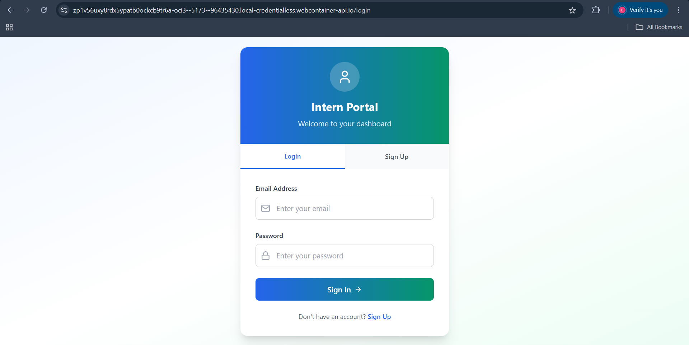
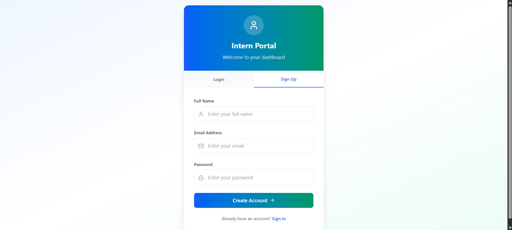
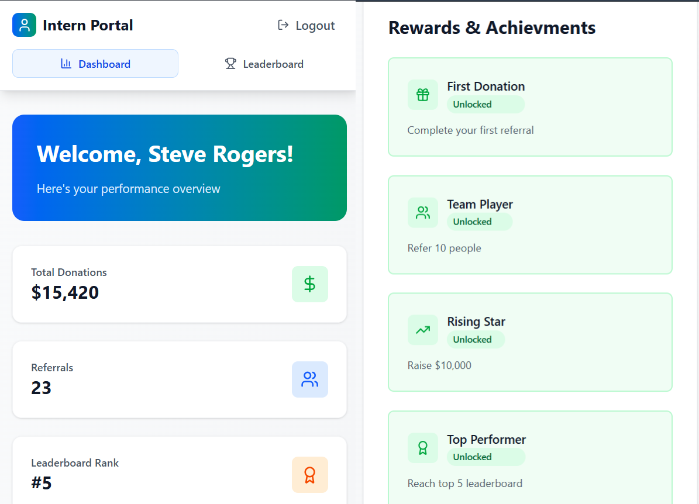
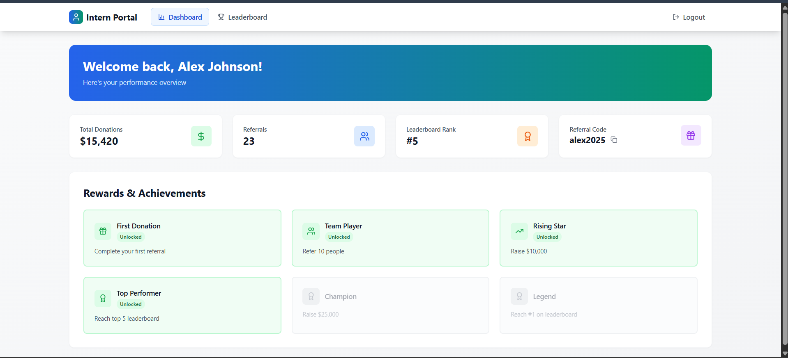
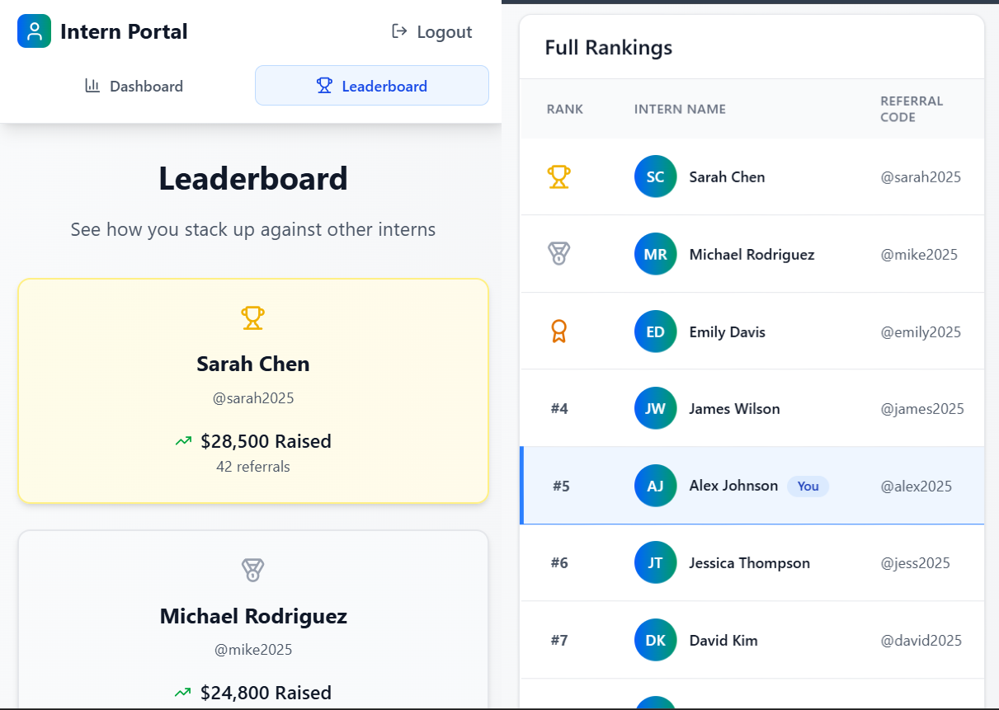
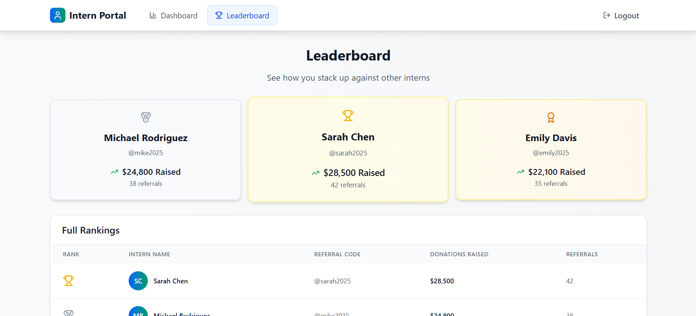
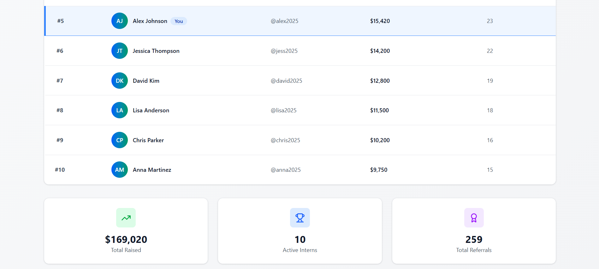

# 🚀 Intern Portal Frontend

This repository contains the **frontend** of the Intern Portal Web App — a dashboard-based application for interns to view their referral performance, track donations, and see their leaderboard rankings.

---

## 📌 Project Overview

The Intern Portal allows users (interns) to:

* **Sign up / Log in** (currently a dummy login system for demonstration)
* **Track their performance**: donations raised, referrals made, and leaderboard rank
* **Unlock achievements** and badges
* **Compare themselves** with other interns through a leaderboard

---

## 🛠️ Tech Stack

* **React.js** — JavaScript frontend framework for building UI components
* **Tailwind CSS** — Utility-first CSS framework for fast and clean styling
* **Fetch API** — For communicating with the backend API

---

## 📄 Pages & Components

| Page             | Description                                                                |
| ---------------- | -------------------------------------------------------------------------- |
| **Login Page**   | Allows users to enter email and password *(dummy login for now)*           |
| **Sign-Up Page** | Enables new users to register                                              |
| **Dashboard**    | Displays personalized metrics like donations, referrals, and referral code |
| **Leaderboard**  | Shows top interns and full rankings with donation and referral data        |

**Main Components:**

- `Navbar.jsx` – Top navigation bar
- `Layout.jsx` – Page layout wrapper with header, footer, and children

---

## 🔌 Backend API Integration

All metrics and leaderboard data are fetched from the **backend**, which currently returns **dummy data** for demonstration purposes.
The frontend connects to:

```
GET http://localhost:8080/api/leaderboard
GET http://localhost:8080/api/intern
```

Make sure backend is running and accessible before running this frontend locally.

---

## 🖼️ Screenshots

### 🔐 Login & Signup Page  
*Single screen with toggle for Login ↔ Signup*




---

### 📊 Dashboard  
**Mobile View:**



**Desktop View:**



---

### 🥇 Leaderboard  
**Mobile View:**



**Desktop View:**

  



> 📁 All screenshots are stored in a folder named `/screenshots` in the root of the project.

---

## 🚀 Getting Started Locally

1. Clone this repository

```bash
git clone https://github.com/jatin-ukey21/Frontend-internPortal
```

2. Navigate into the project

```bash
cd intern-portal-frontend
```

3. Install dependencies

```bash
npm install
```

4. Start the development server

```bash
npm run dev
```

> ⚠️ Important: Ensure the backend is running on http://localhost:8080 before launching the frontend.

---

## 📂 Folder Structure

```
src/
├── components/
│   ├── Navbar.jsx
│   └── Layout.jsx
├── pages/
│   ├── LoginSignup.jsx
│   ├── Dashboard.jsx
│   └── Leaderboard.jsx
├── App.jsx
└── main.jsx
```

---

## 📬 Contact

For queries or suggestions, feel free to reach out via GitHub Issues.

---

### 🔗 Backend Repository

[Link to Backend Repo](https://github.com/jatin-ukey21/Backend-internPortal)

---

Thank you for reviewing this project! ✨
